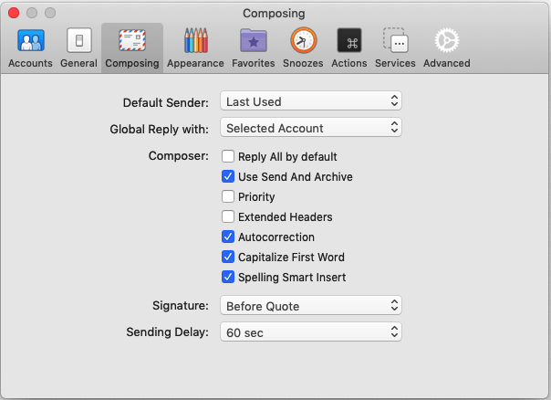
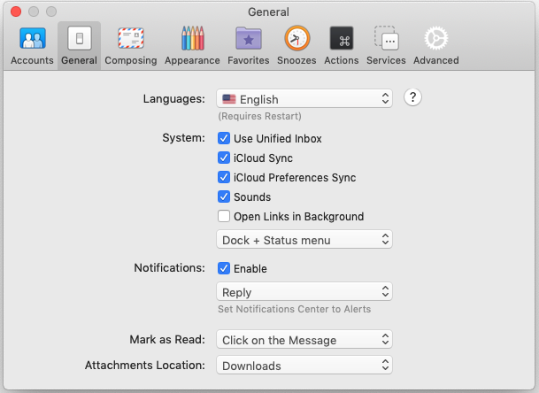
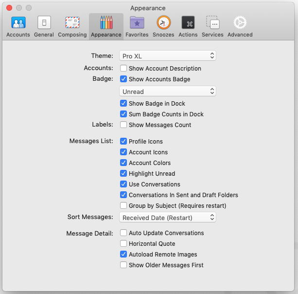
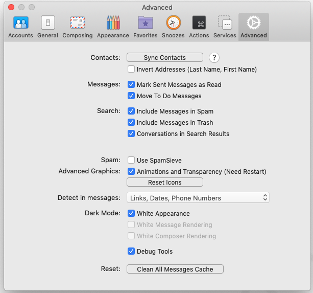

# Various App Settings

These settings are optional. Some of them are highly subjective and should not be considered as the best settings. To each is own.

## Develop Tools

### FileZilla

- Import all save ftp connection
  - https://my.1password.com/vaults/all/allitems/dvaksdajv5hc3gz3zp6j5367m4
- Separe Set Production server and set red collor

### Google Chrome

- Sync all google account
  https://my.1password.com/vaults/all/allitems/ozh4dt5xlreexi6kabvdon6jau
  https://my.1password.com/vaults/all/allitems/s2bxmxxerzby7ehwk4ey6o4dii
  https://my.1password.com/vaults/all/allitems/nrlfuvxs4fgabjih3tfwbejwl4
  https://my.1password.com/vaults/all/allitems/3f22tkog4bhmnn2fpkwnu45lvm

- Install addons
  - My Words Discoverer: Expand your vocabulary - Highlights rare English dictionary words and idioms on web pages. Facilitates English language learning and expands your vocabulary.
  - 1Password extension (desktop app required) - Extends the 1Password app on your Mac or Windows PC, so you can fill and save passwords in your browser.
  - AdBlock — best ad blocker - Block ads and pop-ups on YouTube, Facebook, Twitch, and your favorite websites.
  - Droplr - Screenshot, Annotate, & Screencast - Screen capture FULL webpage or any part of it. Take screenshots, annotations, screen recordings with audio narration.
  - Google Translate - View translations easily as you browse the web. By the Google Translate team.
  - Lighthouse - Lighthouse
  - Material DevTools Theme - A developer tools color theme inspired by the Material Theme UI plugin for IntelliJ IDEA.
  - Notion Web Clipper - Use our Web Clipper to save any website into Notion.
  - PHP Console - Display PHP errors & vars dumps in Google Chrome console and notification popups, execute PHP code remotely.
  - PixelParallel by htmlBurger - PixelParallel by htmlBurger - Pixel perfect HTML vs Design tool for developers
  - React Developer Tools - Adds React debugging tools to the Chrome Developer Tools. Created from revision a8b8ffb89 on 10/3/2019.
  - Wappalyzer - Identify web technologies
  - Web Developer - Adds a toolbar button with various web developer tools.

### MAMP PRO

- Create folder **./site** for all active project
- active licence key
- https://my.1password.com/vaults/all/allitems/jm5z7o5z5lsirga52lzw3bm4gq

### MySQLWorkbench

- import saved database connection
  <!-- TODO create export file -->

### Visual Studio Code

- [Visual Studio Code](../VisualStudioCode/README.md)

### iTerm

- [iTerm](../iTerm/README.md)

### GPG Keychain

- Generate key for github:
  - https://help.github.com/en/github/authenticating-to-github/generating-a-new-gpg-key

### ImageOptim

- Uncheck enable lossy compress
- check Guetzli compr

### Safari

- check checkbox Advanced -> Show Develop in menu bar

---

## Utility Tools

### 1Password 7

- Login to account, use **1password emergency kit**

### Alfred 4

- set hot key on ⌘ + space

### SnippetsLab

- Import all snipets
  https://my.1password.com/vaults/all/allitems/3kcsjsqoqjchzmhpltnnjsdca4
- login to icloud
  https://my.1password.com/vaults/all/allitems/5irne2bgu5aarj5x5kdrb4h7oq

### TeamViewer

- login to acocunt
  https://my.1password.com/vaults/all/allitems/3rh5dmrlwbe6fc7eumq2qxjrbe
- set password computer

### Unclutter

- Insert licence [key](https://my.1password.com/vaults/all/allitems/omdpfc23mdkfciump7b3riv37q)

### Paste

- Set history Capacity on Month

### Focus

- Enter Licence key:
  https://my.1password.com/vaults/all/allitems/uibo7j2ydosf5jhcduem7pd2l4

### Gemini 2

- Enter Licence key:
  https://my.1password.com/vaults/all/allitems/yglgbcg4ztflgjmqbfe7rhjvai

---

## Office Apps

### Airmail

- Add all the accounts into airmail
- Update icons and signatures for all the accounts
- Set Dending Delay
- Change appearance
- Set favorite Folders

---

## Fun / Personal app

### e-Deklaracje

- import database

### e-pity

- import database

# Cloud Settings:

- Sourcetree
- Zeplin
- Notion
- Money Pro
- Adobe
- Figma
- feedly
- Spotify
- TogglDesktop
- Trello
- CloudMounter
- Discord
- Droplr
- OmniFocus
- Slack
  - [Login to account](../Login/README.md)
