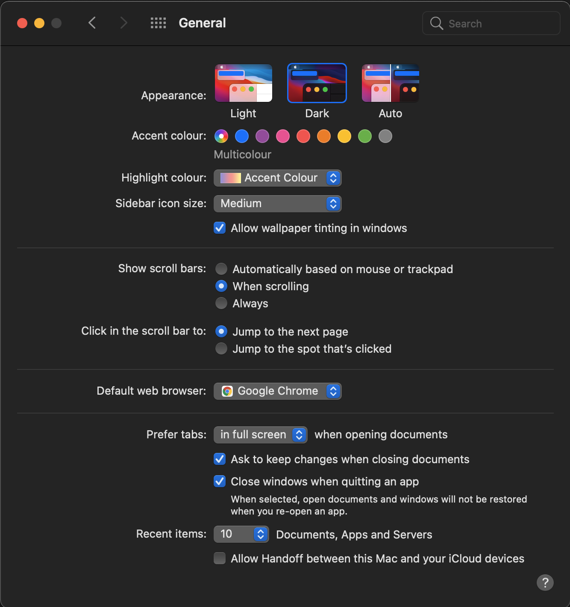
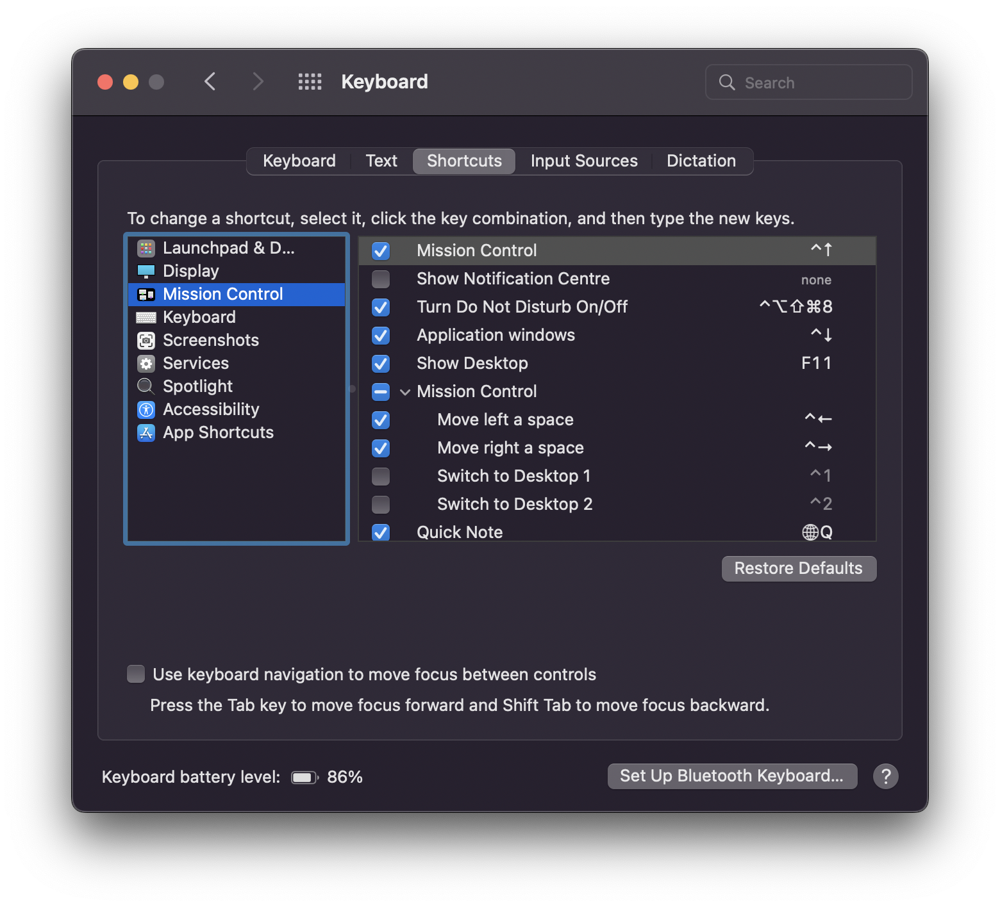
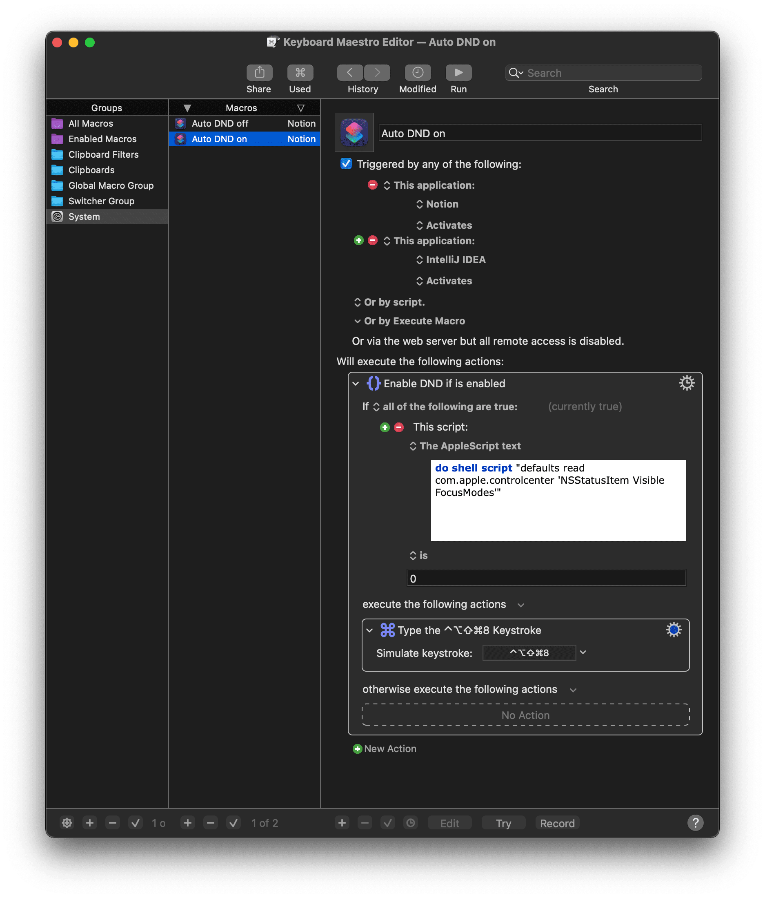
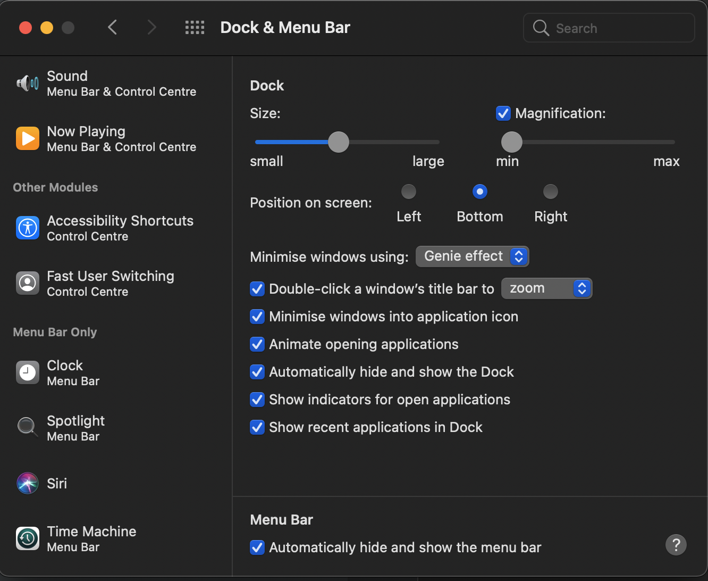
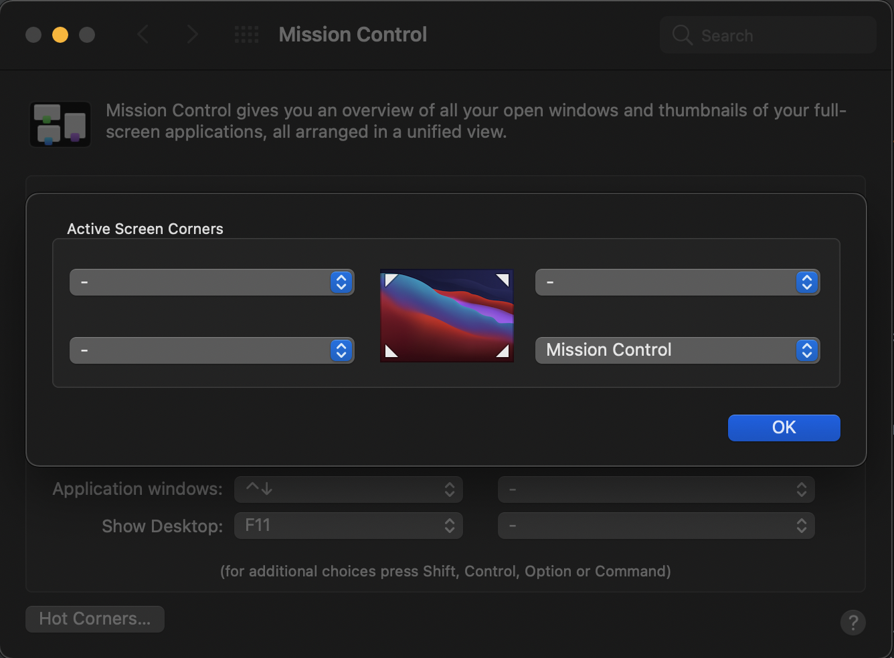
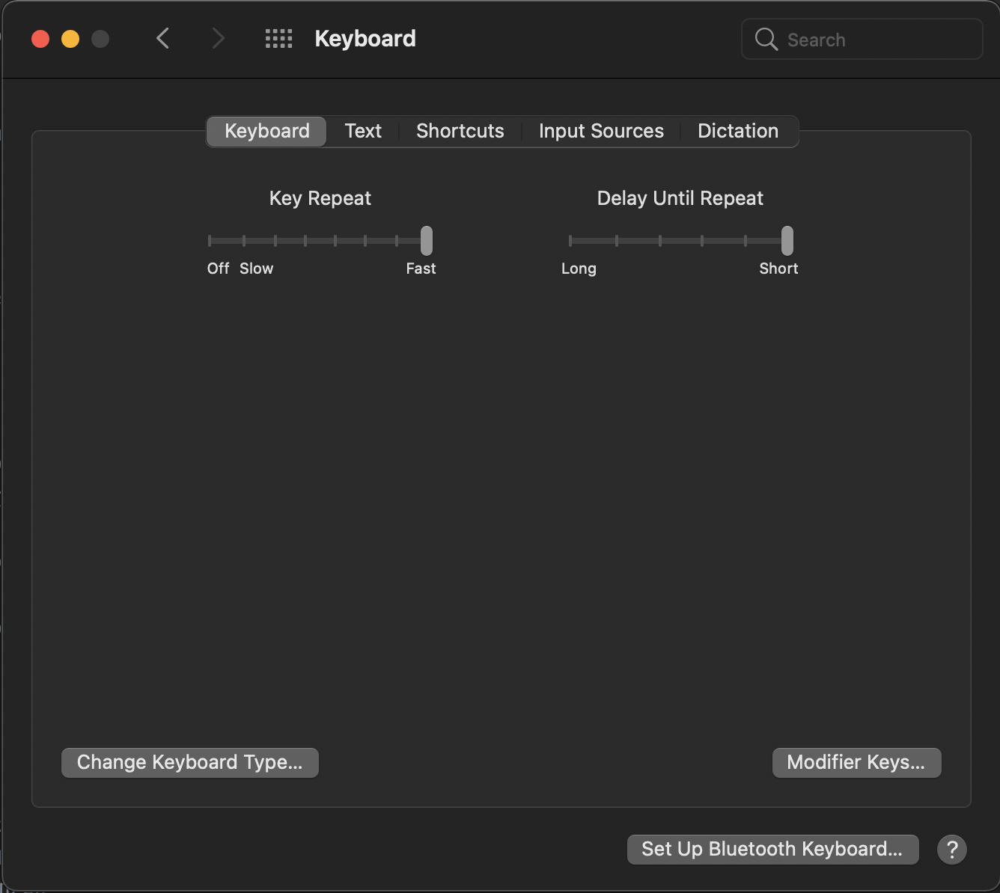
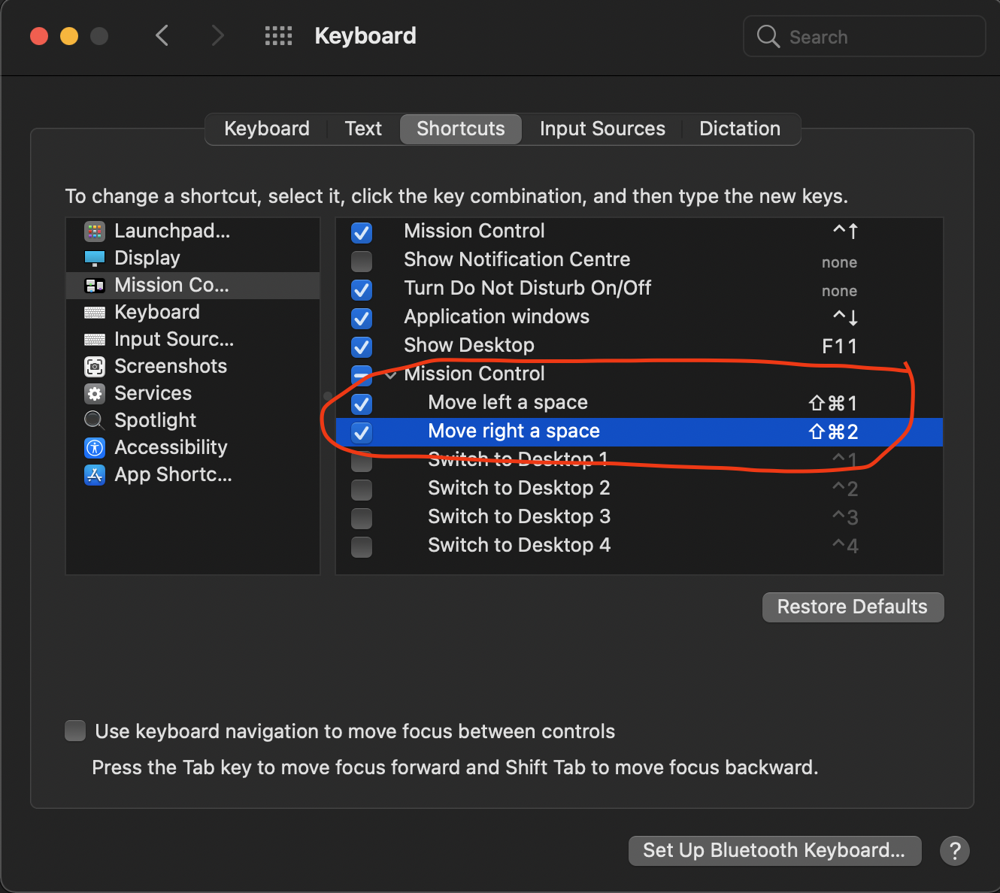
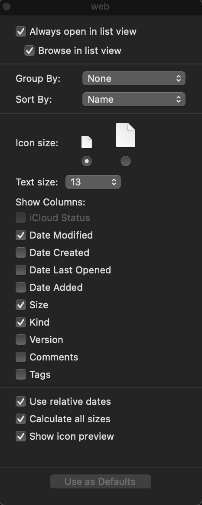
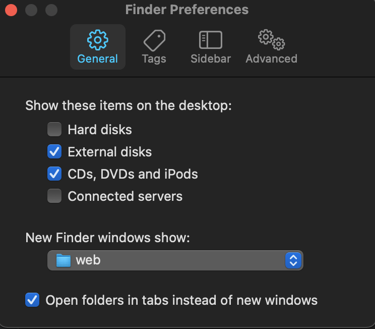

# System Preferences

#TL;DR

## Accessibility
 ```bash
  defaults write com.apple.universalaccess closeViewScrollWheelToggle -bool true
  defaults write com.apple.universalaccess closeViewShowPreview -bool true
  defaults write com.apple.universalaccess closeViewSmoothImages -bool true
  defaults write NSGlobalDomain ApplePressAndHoldEnabled -bool false
 ```

## Dock
 ```bash
  defaults write com.apple.dock autohide -bool true
  defaults write com.apple.dock tilesize -int 45;
  defaults write com.apple.dock magnification -bool false;
  defaults write com.apple.dock show-process-indicators -bool true
  defaults write com.apple.dock minimize-to-application -bool true
  defaults write com.apple.dock launchanim-immutable -bool false
  defaults write com.apple.dock launchanim -bool false
  killall Dock
  ```

## Notifications
```bash
  defaults write com.apple.mcxMenuExtras Battery.menu -bool true
  defaults write com.apple.mcxMenuExtras Bluetooth.menu -bool true
  defaults write com.apple.mcxMenuExtras CPU.menu -bool true
```

## System Tweaks
  ```bash
  mkdir -p ~/Documents/screenshots
  defaults write com.apple.screencapture location ~/Documents/screenshots && killall SystemUIServer
  defaults write NSGlobalDomain KeyRepeat -int 0
  defaults write NSGlobalDomain AppleShowAllExtensions -bool true
  defaults write com.apple.finder ShowPathbar -bool true
  defaults write com.apple.finder ShowStatusBar -bool true
  defaults write com.apple.finder _FXShowPosixPathInTitle -bool true
  defaults write -g AppleShowAllExtensions -bool true
  defaults write com.apple.desktopservices DSDontWriteNetworkStores -bool true
  defaults write com.apple.desktopservices DSDontWriteUSBStores -bool true
  ```


## First Time Setup

The first thing you should do is update your system. To do that go:
**Apple menu () > About This Mac > Software Update.**

Also, upgrade your OS to the latest version to have a more secure OS. macOS
upgrades are usually free so you might as well keep your machine up to date.

If this is a new computer there are a couple of tweaks you could make to the
System Preferences. **These settings are all optional, consider their
suggestions. Always choose the setting that makes the most sense to you.**

## General

- Set Appearance > Dark
- Show scroll bars: When Scrolling
- Set Default web Browser -> Google Chrome
- Check checkbox _Ask to keep changes when closing documents_
- Check checkbox _Close windows when quitting an app_
- Allow Handoff between this Mac and Your ICloud devices



## DND
- Set shortcut to `⇧ + ⌃ + ⌥ + ⌘ + 8` - _This is the capslock shortcut from Karabiner-Elements_



Next, we set up two macros in Keyboard Maestro. One will listen for activation of selected applications and the other for deactivation:




You can import those macros do Keyboard Maestro from [Here -> Auto-DND-on-off.kmmacros](Auto-DND-on-off.kmmacros)


## Desktop & Screen Server

select screen server tab and 

- Show screen server after 20 minutes

## Dock & Menu Bar

### Dock & Menu Bar

#### Dock

  - set off for Magnification 
  - check Automatically hide and show the menu bar



### Control Centre

  Show in Menu bar

  - Wifi
  - Bluetooth
  - Do Not Distrub - when active
  - Sound
  - Now Playng
  - Accessibility Shortcuts
  - Fast User Switching

### Menu bar Only
   
   #### Clock
    
  - Use a 24- hour clock
  - Display the time with seconds
  
  #### Siri
    
  - off

## Mission Control
- uncheck _Automatically rearrange Spaces based on most recent use_ 
set right down corner as activate Mission Control
- Hot Corners -> right bottom corner -> select _Mission Control_




## Siri

- turn off


## Spotlight

 uncheck from list

- Bookmarks & History
- Definition
- Films
- Fonts
- Music

## Accessibility

### Zoom

check _Use scroll gesture with modifier key to zoom_
- ^ Control
- set Zoom style as Picture-in-picture

### Display
 - check _Reduce transparency_

## Keyboard

### Keyboard tab
- Key Repeat Set as a Fast
- Delay Until Repeat set as a Short



### Shortcuts tab

#### Mission Control

Change shortcut Move left and right a space to
- _command ⌘ + shift ⇧ + 1_
  - _⌘ + ⇧ + 1_
- _command ⌘ + shift ⇧ + 2_ 
  - _⌘ + ⇧ + 2_ 




## Users & Groups

- Create One account for workspace
- Create One account utility uses

- _Login Options_ -> _Change fast user switching menu as Icon_

- Set up _Password_, _Apple ID_, _Picture_, etc.

## Internet Accounts

- Add an _iCloud account_ and sync _Calendar_, _Find my Mac_, _Contacts_ etc.

 
# Finder
- use command `⌘ + ⇧ + .` to show hidden file 

- check calculate all file size in (⌘+ J)



open Finder preferences (⌘ + ,)
- General
  - Change _New finder window show_ to open in your Directory with all project for eg `~/web`


    
- Sidebar
  - Add Directory with all project
  - Uncheck all unused boxes
  

# UTILS

## Intro Note:
Apple's default system settings are limiting and don't show a lot of information. Let's change the settings for better usability around the system.
Note: keep in mind you probably have to re-open Finder or Terminal to see these changes

- Enable _repeating keys by pressing and holding down keys_ (remember to restart any app that you need to repeat keys in)
  ```bash
  defaults write NSGlobalDomain ApplePressAndHoldEnabled -bool false
  ``` 
- Change the default folder for screenshots
  ```bash
  mkdir -p ~/Documents/screenshots
  defaults write com.apple.screencapture location ~/Documents/screenshots && killall SystemUIServer
  ```

- Set fast keyboard key repeat rate
  ```bash
  defaults write NSGlobalDomain KeyRepeat -int 0
  ```

- Show filename extensions by default
  ```bash
  defaults write NSGlobalDomain AppleShowAllExtensions -bool true
  ```

- Show Path Bar and Status Bar in Finder

  ```bash
  defaults write com.apple.finder ShowPathbar -bool true
  defaults write com.apple.finder ShowStatusBar -bool true
  ```

- Show Full Path in Finder Title Bar

  ```bash
  defaults write com.apple.finder _FXShowPosixPathInTitle -bool true
  ```

- Show All File Extensions

  ```bash
  defaults write -g AppleShowAllExtensions -bool true
  ```

- Disable Creation of DS_Store Files on Network Volumes and USB Drives

  ```bash
  defaults write com.apple.desktopservices DSDontWriteNetworkStores -bool true
  defaults write com.apple.desktopservices DSDontWriteUSBStores -bool true
  ```
