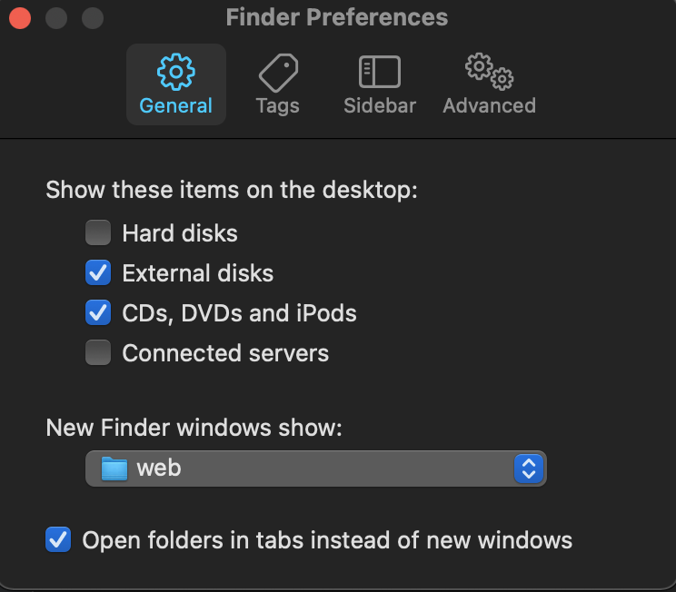

# Projects Directory


If you don't already have one, create a projects directory somewhere on your machine. I like to use `~/web/project-name`. I prefer my `web` folder to exist with the rest of my user profile folders.

```bash
mkdir -p ~/web
``` 

## Finder
> This is repeat setup from [System Preferences #Finder](../SystemPreferences/README.md#Finder)

open Finder preferences (⌘ + ,)
- General
  - Change _New finder window show_ to open in your Directory with all project for eg `~/web`



## Terminal
  > file `~/.aliases` is part of setting from ohmyzsh

 - add this line alias to file `~/.aliases`

 `alias w="cd ~/web"`

  This gives me instant access to the Project Directory from the terminal by typing `w`
