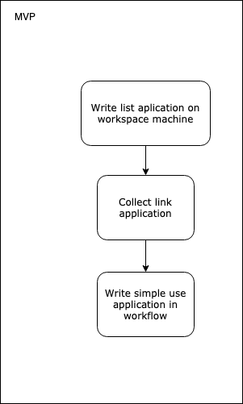

# My workspace Mac

This document describe configuration my Work machine.

### List Contents inventory

- [Plan development idea](Plan%20development%20idea)
  - [MVP](MVP)
  - [Milestone Map](Milestone%20Map)
    - [Build milestone Map](Build%20milestone%20Map)
  - [Feature Idea](Feature%20Idea)

* [Aplication](Aplication)

# Plan development idea



## MVP

- Write list aplication on my workspace machine
- Collect link application
- Write simple use application in workflow

## Milestone Map

### Build milestone Map

The milestone map is built using [Draw.io](https://www.draw.io). Project file can be found at [`Work-Space-milestone-map.xml`](Work-Space-milestone-map.xml) file.

## Feature Idea

- Create synergy template for contribute
- Descryption my default configuration on work machine
- Craete small web applicaton

# Aplication

 List aplication on my workspace machine.

- ### Develop

  - FileZilla
  - Firefox
  - Google Chrome
  - MAMP PRO
  - MySQLWorkbench
  - Sourcetree
  - Visual Studio Code
  - iTerm
  - Zeplin
  - GPG Keychain
  - ImageOptim

- ### Utility

  - 1Password 7
  - Alfred 3
  - CloudMounter
  - Discord
  - Droplr
  - Focus
  - Keka
  - Magnet
  - OmniFocus
  - Paste
  - Slack
  - SnippetsLab
  - TeamViewer
  - TogglDesktop
  - Trello
  - Unclutter

- ### Graphic

  - Adobe
    - After Effects
    - Illustrator
    - InDesign
    - Media Encoder
    - Photoshop
    - Sketch
    - Figma

- ### Fun

  - feedly
  - Spotify

- ### Office app
  - Acrobat DC
  - Airmail Beta
  - Notion
  - Microsoft Excel
  - Microsoft Word
  - Money Pro

<!-- ### About aplication

#### Paste


| Descryption            | Link                                               |
| ---------------------- | -------------------------------------------------- |
| Website                | [pasteapp.me](https://pasteapp.me/)                |
| Direct download adress | [Download Paste](https://pasteapp.me/mac/download) |

##### Descryption

Paste is a smart clipboard and snippets manager

## Brew

tag: git

https://help.github.com/articles/about-commit-signature-verification/
brew install gnupg

https://github.com/robbyrussell/oh-my-zsh/wiki/Installing-ZSH
brew install zsh zsh-completions

## Configuring VS Code

https://medium.com/@ozzievee/configuring-vs-code-integrated-terminal-to-use-oh-my-zsh-f545de1545c1

```shell
// Use ZSH as the integrated terminal
shell."terminal.integrated.shell.osx": "zsh",

//Use ZSH as the integrated terminal
"terminal.integrated.shell.osx": "/usr/local/bin/zsh"
```

# Google Chrome Configuration

https://github.com/jaysuz/material-dev-tools

```
chrome://flags/#enable-devtools-experiments
``` -->
