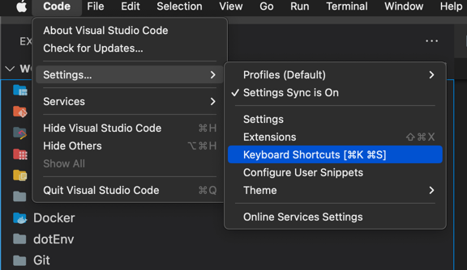

# Visual Studio Code

[Visual Studio Code](https://code.visualstudio.com/) is a lightweight code editor with support for many programming languages through [extensions](https://code.visualstudio.com/docs/editor/extension-gallery)

## Installation

To install the latest version, use Homebrew:

```bash
brew cask install visual-studio-code
```

## macOS integration

Launch VS Code from the [command line](https://code.visualstudio.com/docs/setup/mac#_launching-from-the-command-line).

## Launching from the command line

You can also run VS Code from the terminal by typing 'code' after adding it to the path:

* Launch VS Code.
* Open the **Command Palette** (`kbstyle(Cmd+Shift+P)`) and type 'shell command' to find the **Shell Command: Install 'code' command in PATH** command.


* Restart the terminal for the new `$PATH` value to take effect. You'll be able to type 'code .' in any folder to start editing files in that folder.

>**Note:** If you still have the old `code` alias in your `.bash_profile` (or equivalent) from an early VS Code version, remove it and replace it by executing the **Shell Command: Install 'code' command in PATH** command.


After that, you can launch VS Code from your terminal:

- `code .` will open VS Code in the current directory
- `code myfile.txt` will open `myfile.txt` in VS Code

# Launching from the command line

You can also run VS Code from the terminal by typing 'code' after adding it to the path:

Launch VS Code.
Open the Command Palette (⇧⌘P) and type 'shell command' to find the Shell Command: Install 'code' command in PATH command.
macOS shell commands

# Keybindings

* Install IntelliJ IDEA Keybinding extension for VSC



